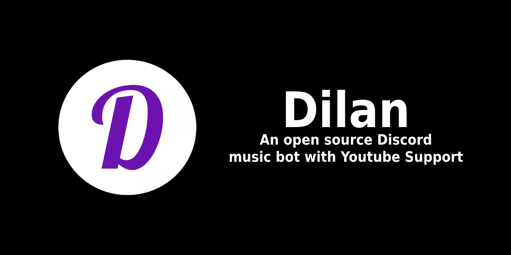

<h2>Backstory</h2>
After Google shut Rythm and Groovy down, me and my friends were looking for a way to once again hear the famous song "Never Gonna Give You Up" on our Discord server. <br>
We have tried out many other projects, but weren't satisfied with the results, as many of the bots started using SoundCloud as their source of audio, in fear of being shut down by Google, or their functionality was very different from what we had grown accustomed to. <br> <br>
That's how Dilan was born; <b>A bot that is easy to use and uses YouTube as it's audio source!</b> <br> How neat is that! <br>
We build it on top of Spring Framework and Javacord, popular and stable libraries, widely used in the Java community.
The audio is being sourced using an updated fork of Lavaplayer, so YouTube compatibility is almost guaranteed at all times.

<h2 style="text-align: center">
<a href="https://discord.com/api/oauth2/authorize?client_id=913511878523752519&permissions=8&scope=bot">Add the bot to your server by clicking this link!</a>
</h2>

<h2>Features and usage</h2>

The bot's default prefix is "dilan", every command uses this pattern: <br>
`[prefix] [command] [arguments]`

<ul>
<li>
    Play music from YouTube by using the "play" command and either typing in the title of the song, or passing a URL. <br>
    Control the playback by using the "skip", "pause", "loop", "clear" or "stop" commands. <br>
    The "play" command without any arguments is used to resume the track after it has been paused.
</li>
<br>
<li>
    The bot automatically leaves the VC after everyone else has left it; <br>
    You can also force it to leave by using the "disconnect" command
</li>
<br>
<li>
    Fetching random posts from subreddits! You can use it for posting memes, copypastas or anything you like! <br>
    Use the command "reddit" followed by the name of the subreddit
</li>
<br>
<li>
    Have a tough decision to make? Use the "8ball" command followed by your question and let the fortune decide for you!
</li>
<br>
<li>
    You want to have a karaoke party on your server? Use the "lyrics" command to get lyrics for the song that is currently playing, or type "lyrics" followed by the name of the song to get precisely what you want
</li>
<br>
<li>
    Don't like the default prefix of the bot? Change it with the "prefix" command, followed by your desired prefix
</li>

</ul>

<h2>FAQ</h2>
<ul>

<li>
Why does the bot require admin privileges?! This is a scam!
<ul>

<li>
No, this is not a scam. You need to grant Dilan admin access, because I was too lazy to implement permission checks.<br>
If you are still unsure about the bot's safety, feel free to look through the code, I assure you that it's 100% safe
</li>

</ul>

</li>
<br>

<li>
Does the bot store my information?<br>
<ul>

<li>
No, we don't store any user-related data.<br>
The server's ID, however, goes into our database, to enable our users to change the prefix of the bot. That's all.
</li>

</ul>
</li>
<br>

<li>
I kicked the bot from my server and added it back, but it won't react to any commands!<br>
<ul>

<li>
There's a high chance that you've changed the bot's prefix! You can change it back, using the "dilan prefix" command.<br>
If the issue still persists, feel free to open an issue on this GitHub project
</li>

</ul>
</li>


</ul>

<h2>How to host the bot yourself</h2>
Before you start, you'll need to create a few access tokens and a database.<br>

<ol>
<li>
Go to <a href="https://discord.com/developers/applications">Discord Developer Portal</a>
and create a new application.

<ul>
<li>Go to the "BOT" tab on the left and click "create a bot"</li>
<li>Scroll down to "Privileged Gateway Intents" and enable all of the options</li>
<li>Scroll down to "Bot Permissions" and select "Administrator"</li>
<li>Now, go to OAuth2 -> Url Generator on the left of the screen</li>
<li>Select "bot", then "Administrator"</li>
<li>What you've ended up with is an invite link that you can use to add the bot to your Discord server!</li>
</ul>

</li>

<br>

<li>
Create a PostgreSQL database.<br>
The easiest way to do that, is by following <a href="https://dev.to/prisma/how-to-setup-a-free-postgresql-database-on-heroku-1dc1">this tutorial</a>. <br>
If you are a technical user, you can of course use a self-hosted Postgres DB.
</li>
</ol>

Now comes the fun part: you'll get to finally start the bot up!<br>

<h3>Hosting the bot on Heroku</h3>
If you've chosen to follow the tutorial on hosting the database on heroku, here's how you can easily host the bot on the same heroku app:<br>

<ol>
<li>Make a private fork of this GitHub repository</li>
<li>On your heroku app's dashboard, go to the "Deploy" tab, and connect your GitHub account to Heroku, then select the forked repository</li>
<li>Now, go to the "Settings" tab, reveal the config vars, and add the one below:

```
key: DISCORD.TOKEN value: yourdiscordbottoken
```
</li>

<li>After doing all of this correctly, head back to the "Deploy" tab, scroll down to the bottom and deploy the master branch</li>
</ol>

Congratulations! You should now have a fully configured and working instance of Dilan, running on Heroku! <br>
You can invite him to your Discord server by using the invite link you've generated in the previous section.

<h3>Hosting the bot on a private server with Docker</h3>

If you're a technical user, good news! <br>
You can also host the bot on your own server by using Docker!
Here's a command that you'll have to run in order to start the bot up on your machine:

```shell
docker run \
            -e SPRING.DATASOURCE.URL=jdbc:postgresql://yourdatabaseurl \
            -e SPRING.DATASOURCE.USERNAME=yourdatabaseusername \
            -e SPRING.DATASOURCE.PASSWORD=yourdatabasepassword \
            -e DISCORD.TOKEN=yourdiscordbottoken \
            eukon/dilan
```
Please note that the command above is intended for Linux hosts. <br>
If you want to use Windows, replace the `` \ `` with `` ` `` <br><br>
I know this command is very, very long, but I don't know how to use Docker Compose at the time of writing this tutorial. <br>
When I'll have a good understanding of it, I'll publish a Compose image and a template '.env' file, that'll allow for easier deployment.
 
<h2>Contributing</h2>
If you have an idea for a new feature or a bugfix, feel free to open an issue or a pull request!

<h2>Credits</h2>
The bot was made using the following libraries:
<ul>

<li>
<a href="https://spring.io">Spring Framework</a>
</li>

<li>
<a href="https://javacord.org/">Javacord</a>
</li>

<li>
<a href="https://github.com/Walkyst/lavaplayer-fork">Lavaplayer Fork</a> by Walkyst (and original Lavaplayer by Sedmelluq)
</li>

<li>
<a href="https://github.com/LowLevelSubmarine/GeniusLyricsAPI">GeniusLyricsAPI</a> by LowLevelSubmarine
</li>

<li>
<a href="https://github.com/google/gson">Gson</a>
</li>

<li>
<a href="http://kong.github.io/unirest-java/">Unirest For Java</a> by Kong
</li>

<li>
<a href="https://flywaydb.org/">Flyway</a>
</li>

<li>
<a href="https://www.postgresql.org/">PostgreSQL</a>
</li>

</ul>

Big shoutout to everyone who has contributed to the projects listed above, without you, Dilan would not be possible!<br><br>
