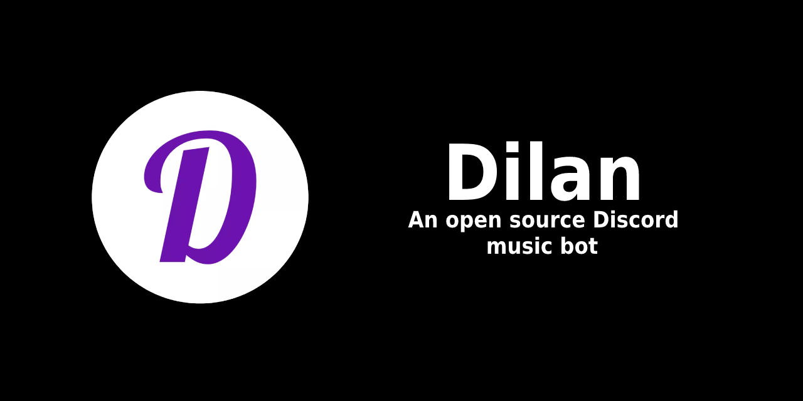

<h2 align="center">
<a href="https://discord.com/api/oauth2/authorize?client_id=913511878523752519&permissions=274914725120&scope=bot">Add the bot to your server by clicking this link!</a>
</h2>

# Disclamer

Development of this bot started a long time ago, so there's a lot of code in it that is not as pretty or as optimized as
it
should be.  
Unfortunately, I'm currently busy with school and my other project (FinanceTracker), so I won't be updating Dilan as
frequently as I'd like to.  
If anything suddenly stops working, please open an issue on this GitHub repo and I'll get to fixing it when I'll have
the time.  
Thanks for understanding.

## Features and usage

This bot supports "slash commands" - just type `/` in your Discord server and all of the commands will appear
automatically.  
The available commands are:

- `play [song title]` - plays the requested song from YouTube, or puts it in the queue if something is already playing
- `play` - resumes the track if paused
- `pause` - pauses the track
- `skip` - skips to the next track in the queue
- `clear` - clears the queue
- `stop` - stops the music and clears the queue
- `np` - shows what track is currently playing
- `queue [page number]` - shows the specified page of the queue. If the page number is empty, it shows the first page.
- `remove [track number]` - removes the specified track from the queue. If the track number is empty, it removes the
  last track in the queue
- `shuffle` - shuffles the queue randomly
- `loop` - enables or disabled looping of the currently playing track.
- `disconnect` - disconnects the bot from a voice chat
- `lyrics [song title]` - shows lyrics for the specified song. If the song title is empty, it shows lyrics for what is
  currently playing
- `8ball [question]` - asks the magic 8-ball the specified question
- `reddit [subreddit]` - shows a random post from the specified subreddit

## How to host the bot yourself

Before you start, you'll need to create a bot on Discord Developer Portal:

- Go to [Discord Developer Portal](https://discord.com/developers/applications) and create a new application.
- Go to the `BOT` tab on the left and click `Add Bot`
- Click `Reset Token` and save it in a safe place - it will be required in the next step.
- Scroll down to `Privileged Gateway Intents` and enable all of the options.
- Scroll down to `Bot Permissions` and select `Administrator` (or the permissions that are set in the invite link
  above).
- Now, go to `OAuth2 -> Url Generator` on the left of the screen.
- Select `bot`, then `Administrator` (or the permissions that are set in the invite link above).
- What you've ended up with is an invitation link that you can use to add the bot to your Discord server!

After you have successfully created your access token and invite link, execute the following command in your terminal:  
`docker run --name dilan -e DILAN_TOKEN=putyourdiscordbottokenhere -d eukon/dilan:latest`  
After a few minutes, the bot should be running on your machine.
You can now add it to your server with the invite link you've created.

## Contributing

If you have an idea for a new feature or a bugfix, feel free to open an issue or a pull request!

## Credits

This bot is using the following libraries:

- [Javacord](https://javacord.org/)

- [LavaPlayer Fork](https://github.com/Walkyst/lavaplayer-fork) by Walkyst

- [GeniusLyricsApi](https://github.com/LowLevelSubmarine/GeniusLyricsAPI) by LowLevelSubmarine

- [Gson](https://github.com/google/gson)

- [Unirest For Java](https://kong.github.io/unirest-java/) by Kong

- [KCommando](https://github.com/koply/KCommando) by Koply
- [8Ball API](https://www.eightballapi.com/)

Big shout out to everyone who has contributed to the projects listed above, without you, Dilan would not be possible!
